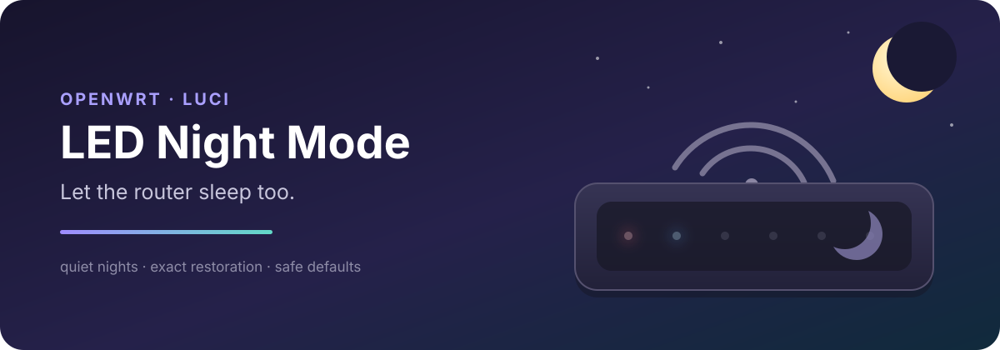

<p align="center">
  
</p>

<p align="center">
  <a href="https://github.com/mv-go/luci-app-led-nightmode/releases/latest"></a>
  <a href="https://github.com/mv-go/luci-app-led-nightmode/actions/workflows/ci.yml"></a>
  <a href="https://github.com/mv-go/luci-app-led-nightmode/actions/workflows/sdk.yml"></a>
  <a href="LICENSE"></a>
</p>

<p align="center">
  A simple LuCI app that quiets software-controlled router LEDs at night,<br>
  then restores their original triggers and state in the morning.
</p>

## Why this exists

It started because my girlfriend could not sleep while little red, blue, and green lights around the apartment kept glowing or blinking at unpredictable moments.

Tape would hide one LED on one device. This project solves the repeatable part of the problem in software: OpenWrt remembers what its controllable indicators were doing, switches to a calm night profile, and puts everything back when night is over.

## The everyday flow

1. Install the package and open **Services → LED Night Mode**.
2. Enable it and choose **Manual**, **Fixed schedule**, or **Sunrise & sunset**.
3. Select **Save & Apply**. The service handles the rest, including after a reboot.

Fresh installations are disabled and do not touch any LED until you explicitly enable the service.

| Safe by default | Fits real nights | Restores normal behaviour | Extensible when needed |
| :--- | :--- | :--- | :--- |
| Night brightness starts at fully off. Nonzero dimming requires deliberate calibration. | Use a fixed local schedule or let `sunwait` follow sunrise and sunset. | Active triggers, brightness, and supported provider state are saved before any change. | Indicators outside Linux sysfs can use separately installed, opt-in providers. |

## Install

The current release is built and validated for **OpenWrt 25.12.4**. Download the base APK from the [latest release](https://github.com/mv-go/luci-app-led-nightmode/releases/latest), copy it to the router, and install it:

```sh
scp luci-app-led-nightmode-0.5.0-r7.apk root@openwrt:/tmp/
ssh root@openwrt 'apk add --allow-untrusted /tmp/luci-app-led-nightmode-0.5.0-r7.apk'
```

Open LuCI, go to **Services → LED Night Mode**, enable the service, choose a schedule, then select **Save & Apply**.

If an indicator is controlled by a modem or another subsystem rather than `/sys/class/leds`, install a matching provider APK as well. The base package never scans serial ports, guesses hardware, or enables a provider on its own. The first provider supports the specifically validated two-field Quectel `QNWCFG ledmode` interface; see [provider architecture](docs/architecture/providers.md) before using or extending it.

## What it can control

The core discovers standard Linux LED class devices at runtime, so names and board-specific assumptions do not enter the general implementation.

```text
LuCI / UCI schedule
        │
        ├── Linux LED class ── save state → night profile → exact restore
        │
        └── optional provider ─ probe → reversible change → exact restore
```

Some physical lights cannot be controlled by software at all. For example, the first test router's PWR LED is wired directly to a power rail. Other indicators may belong to a modem and require an explicit provider. A driver's reported `max_brightness > 1` also does not prove that the physical LED can actually dim; many drivers treat every nonzero value as fully on.

The [compatibility matrix](docs/compatibility.md) separates fixture tests, SDK builds, and real hardware evidence. Release `0.5.0-r7` has a complete core/provider round trip on one Banana Pi BPI-R3 Mini running OpenWrt 25.12.4. Multi-device validation is not claimed yet.

## Under the hood

- Native LuCI page with a simple default view and deeper controls under **Advanced**.
- Manual, fixed-time, and sunrise/sunset scheduling with restart-safe phase resolution.
- Persistent and idempotent restoration, including LEDs that temporarily disappear.
- rpcd/ACL boundary with no arbitrary command or provider-path execution.
- BusyBox `ash` compatible runtime with fixture-backed core, service, schedule, LuCI, and provider tests.
- Architecture-independent OpenWrt packages, built as `noarch` but only claimed where evidence exists.

The service and UCI boundary is documented in [service-and-uci.md](docs/architecture/service-and-uci.md). Hardware findings for the first router live in [bpi-r3-mini-led-inventory.md](docs/hardware/bpi-r3-mini-led-inventory.md).

## Development

Local tests never need a real router:

```sh
make test
```

Before a release candidate or pull request:

```sh
make release-check
```

The root `Makefile` is the OpenWrt LuCI package definition. `GNUmakefile` supplies local checks and delegates to the package definition inside an OpenWrt build tree. See the [SDK build guide](docs/building/openwrt-sdk.md) for a reproducible package build.

For upstream LuCI work, `make stage-upstream DEST=/path/to/luci/applications/luci-app-led-nightmode` creates the universal application tree without the optional hardware-specific provider package. The [upstream release gate](docs/releasing.md#upstream-luci-gate) explains the split and validation workflow.

Contributions are welcome, especially careful compatibility reports and isolated providers for indicators outside Linux sysfs. Please read [CONTRIBUTING.md](CONTRIBUTING.md) first.

## License

[Apache-2.0](LICENSE)
